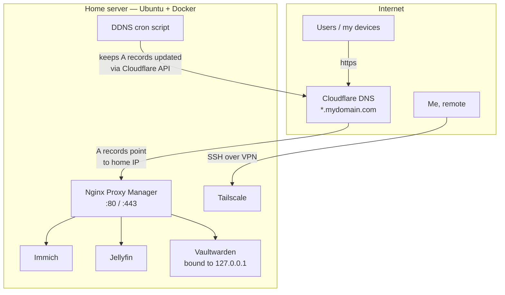

# Homelab

Docker configuration of my self-hosted home server — an Ubuntu Server machine running the services I use every day, reachable from anywhere under my own domain, and administered remotely over a private VPN.

Why self-host? Partly to own my data (photos, passwords, media), partly because building and running your own small piece of infrastructure is the best way to actually learn Docker, networking, DNS and Linux administration.

## Services

| Service | What it does | Why |
|---|---|---|
| [Immich](https://immich.app/) | Photo & video backup with ML-powered search | Self-hosted replacement for Google Photos |
| [Jellyfin](https://jellyfin.org/) | Media streaming server (with Intel hardware transcoding) | My own Netflix for my own library |
| [Vaultwarden](https://github.com/dani-garcia/vaultwarden) | Password manager (Bitwarden-compatible server) | Passwords stay on my hardware |
| [Nginx Proxy Manager](https://nginxproxymanager.com/) | Reverse proxy with automatic Let's Encrypt certificates | One entry point, HTTPS everywhere |

Each service lives in its own folder with its own `docker-compose.yml` and, where needed, a `.env` file (see the `.env.example` files — real `.env` files are never committed).

## Architecture

Two separate paths in and out of the server:



**Public path** — service subdomains are managed on Cloudflare and resolve to my home IP. Nginx Proxy Manager terminates HTTPS (automatic Let's Encrypt certificates) and routes each subdomain to the right container.

**Admin path** — SSH access goes exclusively through [Tailscale](https://tailscale.com/), a WireGuard-based mesh VPN. Port 22 is never exposed to the internet.

### Docker networking

All public-facing containers share a single external network, created once:

```bash
docker network create proxy-network
```

so the reverse proxy can reach every service by container name. Immich's internals (Postgres, Redis/Valkey, machine-learning worker) live on a **separate `internal: true` network**: the database is unreachable from outside the stack — including from the proxy itself.

Other deliberate choices:

- **Vaultwarden is bound to `127.0.0.1` only** — the password manager is never directly exposed; the *only* way in is through the reverse proxy over HTTPS.
- **Secrets via `.env` files**, excluded from version control; this repo ships `.env.example` templates instead.
- **Jellyfin uses `/dev/dri`** for Intel Quick Sync hardware transcoding.

## Dynamic DNS

My ISP assigns a dynamic IP, so the Cloudflare A records would silently break every time it changes. A small bash script ([`scripts/update_dns.sh`](scripts/update_dns.sh)) runs every minute via cron:

```
* * * * * /path/to/homelab/scripts/update_dns.sh >> /path/to/homelab/ddns.log 2>&1
```

It fetches the current public IP, compares it to the last known one (cached in a file), and **only when it changed** updates the A records of every service through the Cloudflare API. The API token is scoped to a single permission — *Zone → DNS → Edit* on this zone only — so even if leaked it can't touch anything else.

## Running a service

```bash
# one-time setup
docker network create proxy-network

# per service
cd immich
cp .env.example .env     # then fill in real values
docker compose up -d
```

## Repository structure

```
homelab/
├── immich/                  # photo backup stack (server, ML, Redis, Postgres)
├── jellyfin/                # media server
├── vaultwarden/             # password manager
├── nginx-proxy-manager/     # reverse proxy + TLS
├── scripts/
│   ├── update_dns.sh        # Cloudflare DDNS updater (cron)
│   └── .env.example
└── .gitignore
```

## Lessons learned & roadmap

- Moving secrets out of compose files and into `.env` files came later than it should have — do it from day one.
- Next up: an automated off-site backup strategy for the Immich library and Vaultwarden data.
- In progress: a small **FastAPI monitoring service** running on the server itself, exposing the health of every container — both a useful tool and an excuse to go deeper into backend development.
